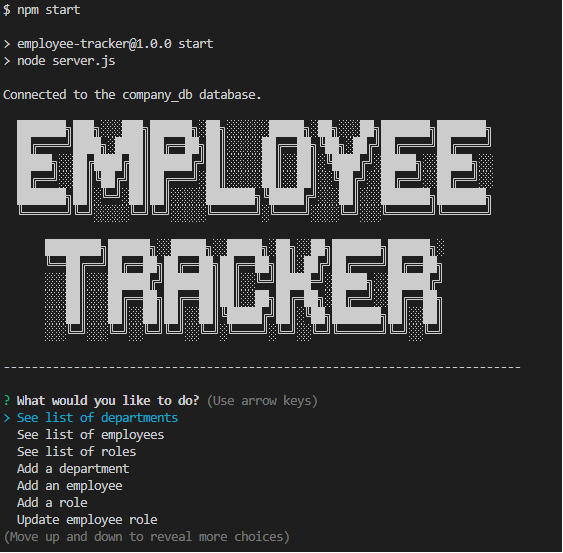
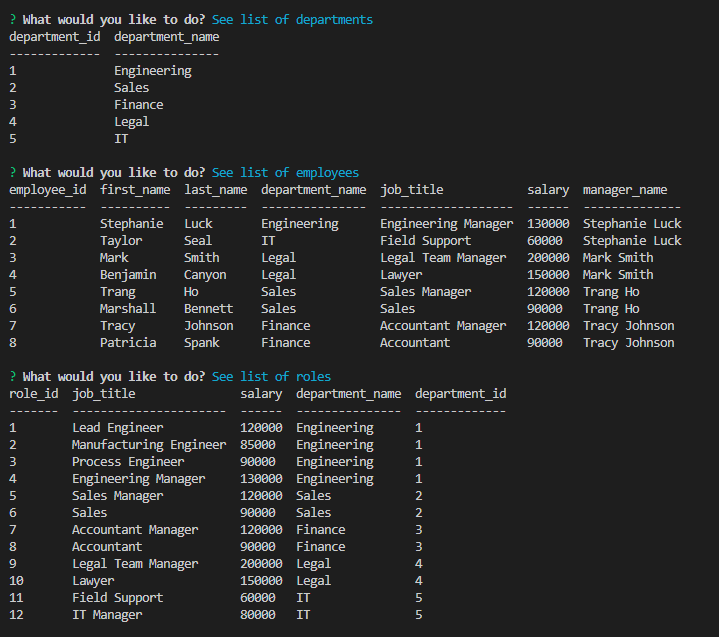

  # Employee Tracker

  ## License: MIT License 
  ### https://opensource.org/licenses/MIT

  ## Table of Contents
  ### - [Project](#Project)
  ### - [Description](#Description)
  ### - [Installation](#Installation)
  ### - [Project Usage](#ProjectUsage)
  ### - [Project Contributions](#ProjectContributions)
  ### - [Testing Instructions](#TestingInstructions)
  ### - [License Info](#License)

  ## Project
  ### Employee Tracker

  ## Description
  ### Employee Tracker is a way to visualize your database of employees!  This application will allow you to view departments, roles and employees as well as add new departments, roles and employees and even update existing employee information.  I built this project as an aid to companies to help assist in keeping track of employee information by using a text-based GUI instead of staring at a SQL database and changing values manually.  This application solves the problem of needing to know SQL in order to manipulate pre-made data tables.  Throughout the project I myself learned some of the in and outs of SQL as well as furthering my knowledge of Inquirer, Javascript promises and a new package called "Console.tables" in order to assist in visualizing all the data.

  ## Installtion
  ### Upon cloning the repository you will need to first install all the dependencies by running "npm i" in your VS Code terminal, you will then need to login to MySQL in the terminal and run "source db/schema.sql;" to create the database and data tables and then run "source db/seeds.sql;" to populate the tables with the pre-loaded data.  You can also delete the data in the seeds.sql file and populate it with your own companies data if you would prefer before running the "source db/seeds.sql;" command.

  ## Images
  
  

  ## Contributors
  ### Taylor Seal - Sealcakes - https://www.github.com/Sealcakes

  ## Links
  ### Demo Video
  https://drive.google.com/file/d/1DwCNKRMVUj_-QztOoZ0F_kS1d8Aa1j_2/view

  ## License Information
  ### MIT License